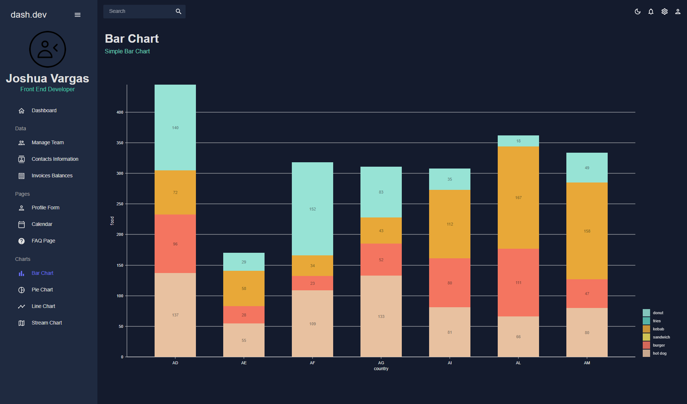

# Admin Panel

This project was bootstrapped with [Create React App](https://github.com/facebook/create-react-app). It was created to showcase the ease of creating a frontend with the use of external libraries and components.

## [Material UI](https://mui.com/)

MUI handles most of the stuff you see including the tables and accordians which are MUI `<DataGrid>` and `<Accordion>` components respectively. MUI is a powerhouse of a UI library and you can rest assured that your frontend filtering logic works because DataGrid has that covered.

## [Formik](https://formik.org/docs/overview)

Formik was used to cut down on the verbosity of forms in React. Formik can handle most of your form needs. Need a schema for validation? Formik combined with [Yup](https://github.com/jquense/yup) can more than get the job done so that you'll have both working and visually appealing validation.

## [FullCalendar](https://fullcalendar.io/)

FullCalendar allows for quick calendar creation without the hours to days of work needed to get everything from layout to events to views done in a a fraction of the time that it would take to create one from scratch. The plugins available also let you customize the calendar so that it fits your business specific needs.

## [Nivo](https://nivo.rocks/)

Nivo handles all data visualization through whatever kind of chart you need. Bar chart? Pie Chart? Stream Chart? Need some lines? Nivo has you covered.

